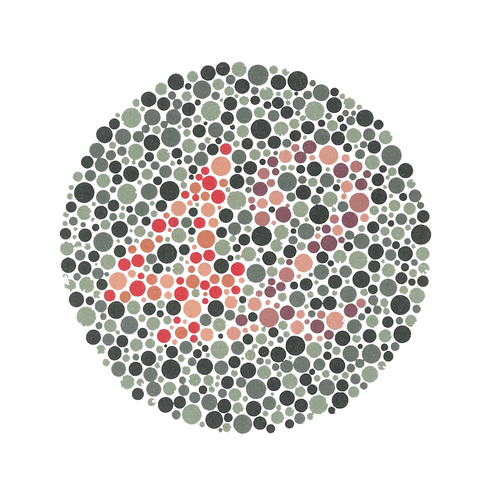
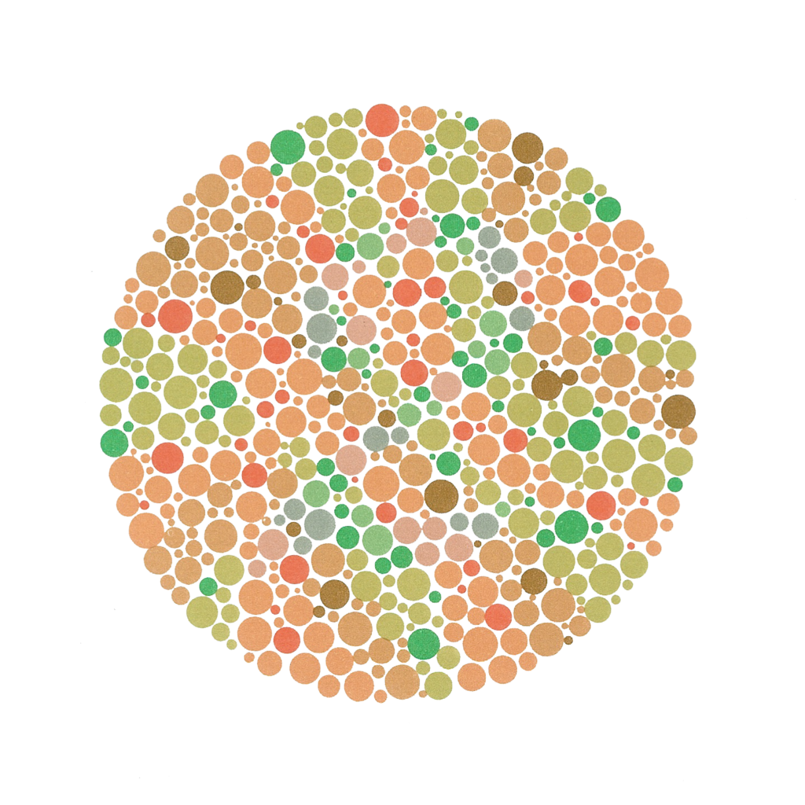
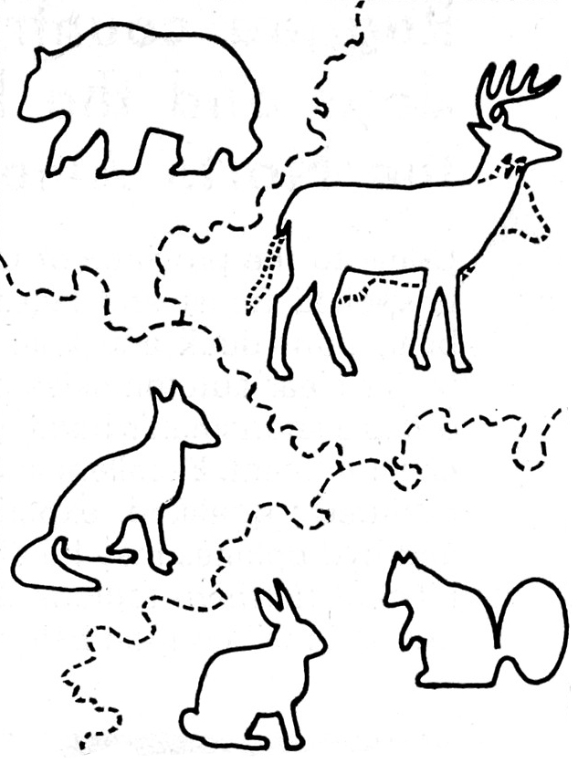

slide-transition: true

[.background-color: #FF0000]
[.header: #FFFFFF]

## So tell me - in your own words - what is "red" ?

---

[.build-lists: true]

## Background

- What colour is that?
- If you know that - how can you be colourblind?
- What does that look like to you?

---

## It's not unusual

8% of men and 0.5% of women are colourblind to some degree.

In 2017 we had 7 developers from my company - three were colourblind and they were all on the same team.

---

## Three main kinds of colourblindness

- Protan: red light
- Deutan: green light (most common)
- Tritan: blue light (extremely rare)

### Suffixes

*anomaly - shifted or reduced response
*opia - complete absense of sensors/cones

Proton and deutan are commonly called red/green.

---

## Protan

- Black with many shades of red
- Dark brown with dark green, dark orange and dark red
- Some blues with some reds, purples and dark pinks
- Mid-greens with some oranges

---

## Deutan

- Mid-reds with mid-greens
- Blue-greens with grey and mid-pinks
- Bright greens with yellows
- Pale pinks with light grey
- Mid-reds with mid-brown
- Light blues with lilac

---

## Tritan

The most common colour confusions for tritans are light blues with greys, dark purples with black, mid-greens with blues and oranges with reds.

---

[.build-lists: true]

## Hard to live with?

I am a medium protan (reduced red) and strong deutan (reduced green)

- Charging LEDs
- Bananas
- Photography/Video
- No - not really - just something you get used to.

---

## Tests

There are many tests out there - for example:

- Ishihara - coloured spots on a plate

- Farnsworth Lantern Test - identify colours of pairs of lights

- Farnsworth-Munsell 100 Hue Test - ordering of colour swatches

- Cambridge Color Test - similar to Ishihara - but you are looking for the letter C

- Anomaloscope Test - match two light sources in brightness and color

---

## Ishihara examples

[.column]

42

[.column]

2 - vanishing

---

[.background-color: #000000]
[.footer-style: #FFFFFF]
[.footer: http://freepages.rootsweb.ancestry.com/~hellmers/test/]

---

[.footer-style: #FFFFFF]
[.footer: http://freepages.rootsweb.ancestry.com/~hellmers/test/]

[.background-color: #000000]

---

## What do children see?

Children with normal vision can see the bear, deer, rabbit, and squirrel. They cannot see the fox.

Children with a red-green color vision deficiency see a cow (instead of the deer), a fox (in the lower left), and usually the rabbit and squirrel. They cannot see the bear.

[.footer: [freepages.rootsweb.ancestry.com/~hellmers/test/](http://freepages.rootsweb.ancestry.com/~hellmers/test/)]

---

## So - what can we do about it?

Testing apps?

Many available - but let's look at SimDaltonism - available for both iOS (you can point your camera at things) and mac.

---

## So - what can we do about it?

Web tools

Let's use chrome inspector on a website.

---

## Summary

Hopefully I've given you some idea of my world of colour.

Luckily for us - helping colour blind people use the web is basically following good universal accessibility rules. If we're doing that right then we've already come a long way.

Oh - and if you ever do find a way to tell me what "red" is - do let me know!
